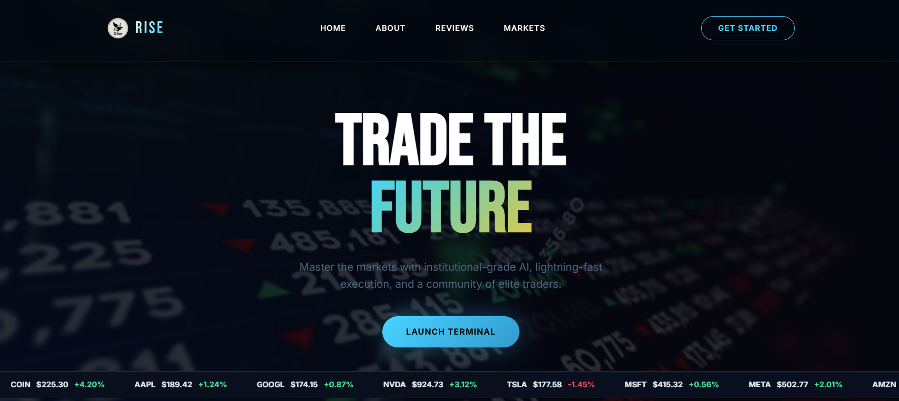
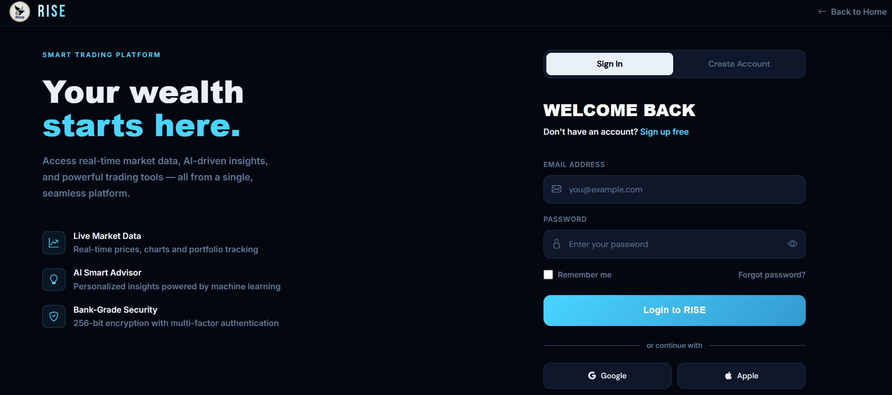
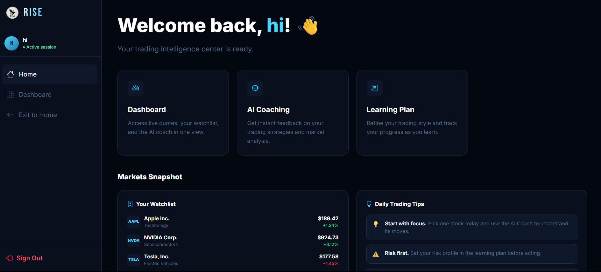
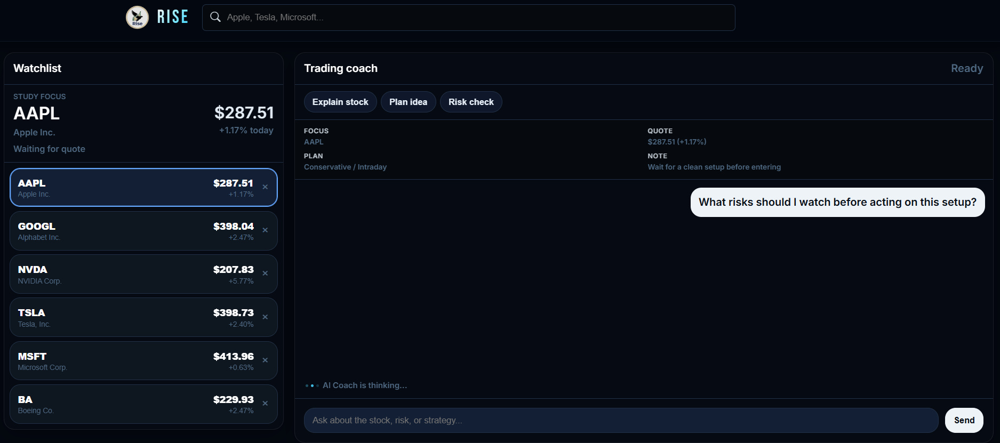
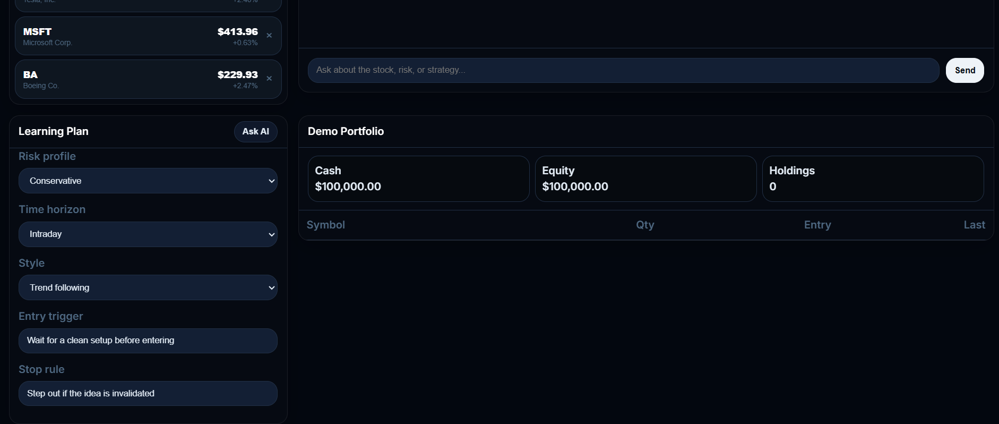

# RISE — AI Powered Trading Learning Platform

RISE is a modern AI-powered trading dashboard and stock learning platform built using Vanilla JavaScript, HTML, and CSS.

The platform combines real-time stock market tracking, AI-powered trading guidance, strategy planning, watchlist management, and responsive dashboard architecture into a single frontend application.

---

# Features

- Real-time stock market watchlist
- Live market quote updates using Alpha Vantage API
- AI Trading Coach powered by Gemini API
- Dynamic strategy planning interface
- Interactive stock dashboard
- Search and add stock functionality
- Auto-refreshing market data
- Session handling using localStorage
- Multi-page frontend architecture
- Responsive glassmorphism UI design

---

# Technologies Used

## Frontend

- HTML5
- CSS3
- Vanilla JavaScript

## APIs

- Gemini API
- Alpha Vantage API

## JavaScript Concepts Used

- DOM Manipulation
- Dynamic Rendering
- State Management
- Event-Driven Architecture
- Fetch API
- Asynchronous Programming
- Promise Chaining
- Event Bubbling
- Debouncing
- Optional Chaining
- Template Literals
- Higher-Order Functions
- Local Storage Authentication

---

# Project Structure

```txt
index.html              → Landing page
login.html              → Login/Register page
welcome.html            → Welcome dashboard
dashboard.html          → Main AI trading dashboard

index.js                → Homepage logic
login.js                → Authentication logic
welcome.js              → Session handling
dashboard.js            → Dashboard functionality

global.css              → Shared styles
homepage.css            → Homepage styling
loginpage.css           → Login page styling
welcomepage.css         → Welcome page styling
dashboardpage.css       → Dashboard styling

assets/
└── screenshots/
```

---

# Screenshots

## Homepage

<p align="center">
  
</p>

---

## Login Page

<p align="center">
  
</p>

---

## Welcome Page

<p align="center">
  
</p>

---

## Dashboard Interface

<p align="center">
  
</p>

---

## AI Trading Dashboard

<p align="center">
  
</p>

---

# Setup Instructions

## 1. Clone Repository

```bash
git clone https://github.com/eshivansh/RISE-AI.git
```

---

## 2. Configure API Keys

Create:

```txt
config.local.js
```

Copy configuration from:

```txt
config.example.js
```

Add your own:

- Gemini API Key
- Alpha Vantage API Key

---

## 3. Run Project

Open:

```txt
index.html
```

in browser.

---

# Project Architecture

The application follows a frontend state-driven architecture.

```txt
State Variables
      ↓
Event Handlers
      ↓
API Requests
      ↓
Dynamic Rendering
      ↓
DOM Updates
```

---

# Key Functionalities

## AI Trading Coach

- Uses Gemini API
- Generates trading guidance dynamically
- Uses live stock market context
- Supports strategy-based prompts

## Market Dashboard

- Dynamic watchlist rendering
- Live market quote fetching
- Auto-refreshing stock prices
- Interactive stock selection

## Search System

- Debounced stock search
- Dynamic dropdown rendering
- API-based symbol lookup

---

# Future Improvements

- Backend authentication system
- Portfolio tracking
- Candlestick chart integration
- Trade analytics
- WebSocket live updates
- User profile system
- Persistent cloud database

---

# Deployment

The project is deployed using GitHub Pages.

---